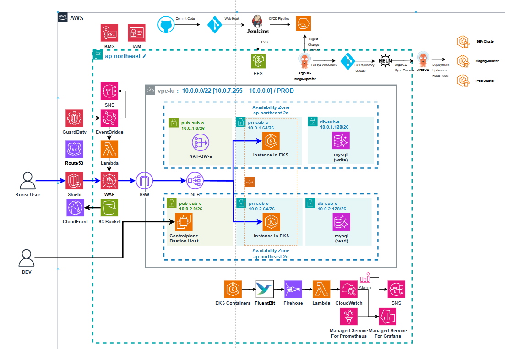
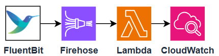
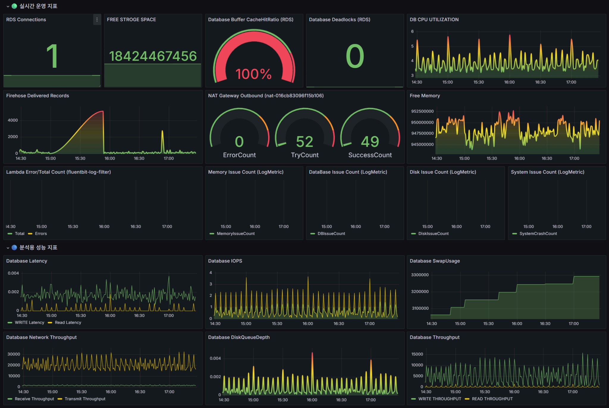
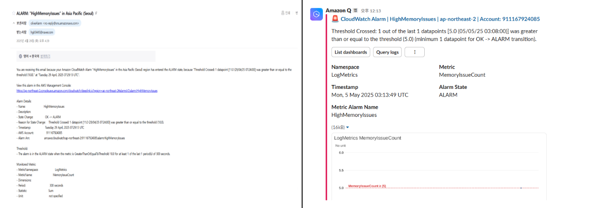
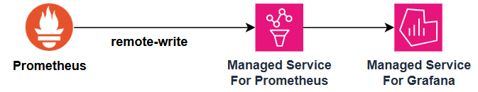
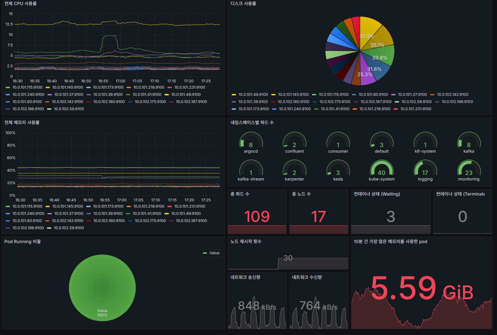
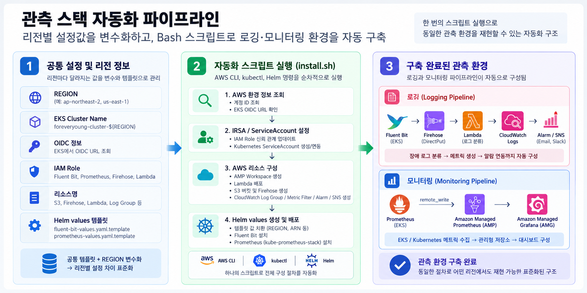
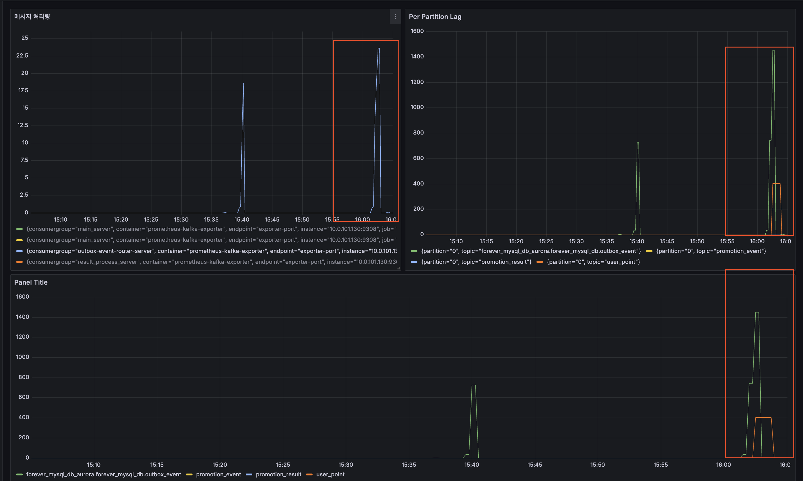
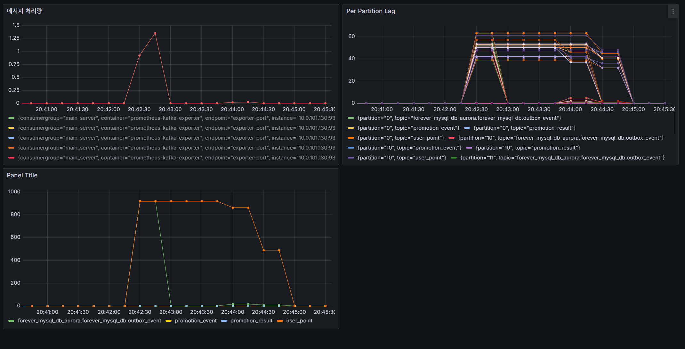
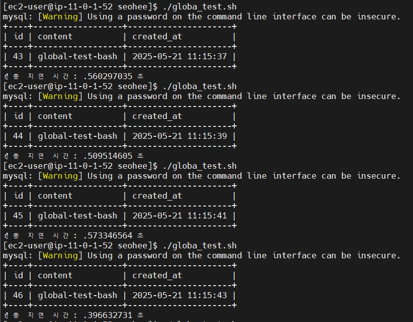

# OliveYoung
# 올리브영 글로벌 서비스 프로젝트
프로젝트 기간 : 2025.03 ~ 2025.06

# 1. 프로젝트 개요

- **배경**
    
    해외에서 한국 브랜드(올리브영)에 대한 관심이 높아지면서, 외국인 사용자도 한국과 동일한 혜택(포인트 적립 등)을 제공받을 수 있는 서비스 환경에 대한 수요가 증가하였다.
    
    포인트 적립은 브랜드 충성도와 직결되므로, **글로벌 사용자에게도 일관된 경험**을 제공하는 것이 중요했다.
    
- **목표**
    1. 글로벌 사용자에게 동일한 포인트 적립 및 조회 서비스 제공
    2. 지연 없는 데이터 처리와 안정적인 인프라 구성
    3. 트래픽 증가에 유연하게 대응할 수 있는 자동 확장 운영 체계 구축

---

# 2. 전체 환경 구성

- **네트워크**
    - 리전별 VPC, 퍼블릭·프라이빗 Subnet 구성 (AZ 분리)
    - NAT Gateway 최소화하여 비용 절감
    - Bastion Host를 통해 내부 자원 접근
- **컴퓨팅 / 컨테이너**
    - AWS EKS (한국, 미국, 일본 리전 클러스터)
    - Auto Scaling 그룹으로 트래픽 변화 대응
- **데이터베이스**
    - Amazon Aurora Global Database
    - 한국 리전: Writer / 미국 리전: Reader
    - **Write Forwarding** 기능 활용 → 미국에서도 쓰기 요청 처리 가능
    - Global 모드(Read Consistency)로 데이터 정합성 보장
- **CI/CD**
    - GitHub Actions → Jenkins → ECR → ArgoCD
    - Image Updater를 통한 GitOps 기반 자동 배포
- **보안**
    - GuardDuty + EventBridge + Lambda + WAF
    - 의심 IP 자동 차단 및 실시간 위협 대응
- **아키텍처 다이어그램**

| 주차 | 주요 진행 내용 |
| --- | --- |
| **1주차 (03/21)** | 아키텍처 구성도 작성, 역할 분담, To-Do 리스트 정리 |
| **2주차 (03/28)** | 시나리오 변경: 미국 오프라인 진출 + 통합 DB 설계 |
| **3주차 (04/04)** | FE/BE 환경 통합, 도메인 분리 및 DB 세팅 |
| **4주차 (04/11)** | VPC/Subnet/EC2 구성, RDS ↔ Spring 연동 시도 |
| **5-6주차 (04/18~04/25)** | EKS/Fluent Bit/Prometheus 구축 및 아키텍처 완성 |
| **7-9주차 (05/02~05/16)** | 멀티 리전(EKS, Aurora, CloudFront) 확장 및 모니터링 강화 |
| **10-11주차 (05/23~05/30)** | DR 및 보안 강화를 통한 완성, 발표자료 정리 |

---

# 3. 내가 맡은 역할 (EKS + 로깅 & 모니터링)

### A. USER 도메인 개발

- 회원 가입(중복 방지 포함)
- 로그인
- JWT 기반 Access Token 발급 및 검증

---

### B. EKS 클러스터 구성

- eksctl + Helm을 활용한 클러스터 배포 및 관리
- 노드 그룹을 **프라이빗 Subnet 전용**으로 배치 → 보안 강화
- IAM OIDC Provider + IRSA로 서비스 계정별 최소 권한 할당

---

### C. 로깅 파이프라인 구축

- **구성 흐름**
    
    앱 로그 → Fluent Bit → Kinesis Firehose → Lambda(Log Filtering) → CloudWatch Logs
    
    ↓
    
    S3 Backup
    
    
    
- **구현**
    - Fluent Bit을 Helm Chart로 배포 → 컨테이너 로그 수집
    - Lambda(Python)로 Memory/Disk/DB/System 오류만 필터링
    - 로그를 CloudWatch + S3에 이중 저장하여 안정성 확보
    - 리전별 동일한 로깅 파이프라인을 **자동 배포 스크립트**로 표준화
- **대시보드**

- **알람**
    - Lambda를 이용해 필터링한 로그가 5분동안 5회 이상 발생하면 이메일과 Slack으로 알람을 전송

---

### D. 모니터링 파이프라인 구축

- **구성 흐름**
    
    애플리케이션 메트릭 → Prometheus (EKS 클러스터) → AMP(Remote Write) → AMG(Grafana)
    
    
    
- **주요 모니터링 지표**
    - CPU / 메모리 사용률
    - 응답 지연 시간(p95, p99)
    - 오류율, 파드 재시작 수
- **자동화**
    - Helm + Terraform + Bash → Prometheus & Fluent Bit 자동 설치
    - CloudWatch Metric Filter & Alarm 생성 → SNS → Slack 알림
- **대시보드**

### 관측 스택 자동화 파이프라인

---

# 4. 기술 이슈와 해결 전략

## 문제 1. [인증 오류 해결] SigV4 연동 복잡성을 AMG 기반 구조로 단순화하여 모니터링 안정성 확보
- **현상:** Prometheus의 AMP 연동과 직접 구축한 Grafana의 AMP 조회 과정에서 IRSA 및 SigV4 인증 설정 문제가 발생해 메트릭 전송·조회 구성이 불안정해짐.
- **해결:** ServiceAccount와 IAM 권한, AMP Data Source URL 및 SigV4 인증 설정을 단계적으로 점검하고 Prometheus → AMP 전송 경로를 정상화. 이후 직접 구축 Grafana의 복잡한 SigV4 인증 경로 대신 **Amazon Managed Grafana(AMG)가 AMP를 조회하는 관리형 구조**로 전환.
- **결과:** Prometheus → AMP → AMG로 이어지는 안정적인 모니터링 경로를 구축하고, 직접 관리하던 Grafana의 SigV4·IAM 인증 복잡도를 제거하여 운영 구조 단순화.

---

## 문제 2. [리전 설정 표준화] 리전별 설정 차이를 변수화·템플릿화하여 관측 환경의 일관성 확보

- **현상:** 리전마다 OIDC, IAM Role, 로그 대상 및 리소스명이 달라 수동 구성 시 설정 누락이나 불일치가 발생할 가능성이 있었음.
- **해결:** `REGION` 변수를 기준으로 리전별 설정을 동적으로 처리하고, Fluent Bit과 Prometheus 설정을 **공통 Helm values 템플릿**으로 구성. EKS OIDC 정보를 조회하여 IRSA 신뢰 관계와 ServiceAccount 설정도 리전에 맞게 적용하도록 구현.
- **결과:** 리전별 설정을 개별 관리하는 대신 공통 변수와 템플릿으로 관리하여 동일한 관측 구성을 재사용할 수 있는 표준화된 구조 확보.

---

## 문제 3. [배포 자동화] 반복되는 관측 스택 구축 절차를 자동화하여 운영 효율성 향상

- **현상:** 로깅·모니터링 환경 구축 시 IAM 설정, AWS 리소스 생성, Fluent Bit·Prometheus 설치 등 반복적인 수동 작업이 필요해 구축 과정이 복잡하고 비효율적이었음.
- **해결:** Bash 스크립트에서 **AWS CLI, kubectl, Helm 명령을 순차적으로 실행**하도록 구성하여 IRSA 설정부터 AMP, Lambda, S3, Firehose, Fluent Bit, Prometheus, CloudWatch Alarm까지 관측 스택 구축 절차를 자동화.
- **결과:** 반복적인 수동 설치 작업을 줄이고, 동일한 절차로 관측 환경을 배포할 수 있는 일관된 자동화 프로세스 확보.

---

# 5. 성능 및 안정성 검증

## 시나리오 1 — 점진적 증가 (Scalability Test)

트래픽을 단계적으로 증가시키며 시스템 확장성을 검증하였다.

### 초기 구성

- 성공률 4~6%
- 평균 응답시간 45~58초
- HTTP 실패율 90% 이상
- Kafka Consumer Rebalancing 반복 발생
- Lag 급증

→ Total Lag 및 일부 Partition Lag 급증이 관찰되었으며, Partition-Consumer 불균형으로 메시지 처리 지연이 발생함을 확인

### 개선 후 (웹 서버 확장 및 Connection Pool 조정)

- 총 요청: 477,452건
- 성공률: 96.7%
- 평균 응답 시간: 2.08초
- p(95): 637ms
- HTTP 실패율 3.29%

→ HTTP 계층 안정성 개선 및 Lag 감소 패턴 확인

---

## 시나리오 2 — 1만명 부하 (Spike)

이벤트 상황을 가정하여 동시 10,000 VU 부하를 적용하였다.

### 결과

- 성공률: 3.5% ~ 6.8%
- 평균 응답 시간: 45~52초
- HTTP 실패율: 93% 이상
- 대부분 60초 타임아웃 발생
- Kafka Lag 급증 및 connection refused 발생

### 분석

- Consumer Rebalancing과 DB 연결 포화가 동시에 발생
- 메시지 적재 속도가 처리 속도를 크게 초과
- 애플리케이션 계층 이전에 메시지 큐 및 네트워크 계층에서 포화 상태가 발생
- 점진적 증가와 달리, 급격한 트래픽 유입에는 Kafka 및 DB 계층의 처리 한계가 명확히 드러났다.

## 부하테스트 결과

점진적 확장에는 안정적으로 대응 가능함을 확인하였다.
반면, 급격한 트래픽 폭증 상황에서는 Kafka 및 DB 계층의 처리 한계가 드러났으며,
대규모 동시 요청에 대한 추가적인 아키텍처 보완 필요성을 확인하였다.

---

## Aurora Global DB 일관성 모드 지연 테스트

Aurora Global Database의 Read Consistency 모드(SESSION / EVENTUAL / GLOBAL)에 따른 읽기 지연을 비교하였다.

### 테스트 방식

- Reader Endpoint (미국 리전)에서 실행
- INSERT 직후 SELECT 수행
- `aurora_replica_read_consistency` 설정 변경
- Bash 스크립트로 지연 시간 자동 측정

### 결과 요약

- **EVENTUAL 모드**: 가장 빠르나 직후 읽기 일관성 보장 불완전
- **SESSION 모드**: 세션 단위 일관성 보장, 지연 시간 중간 수준
- **GLOBAL 모드**: 가장 강한 일관성 보장, 상대적으로 높은 지연 발생

→ 글로벌 환경에서 일관성과 응답 지연 간의 Trade-off 존재 확인

### 추가 확인 사항

- Write Forwarding 환경에서는 DDL 실행 불가 (read-only 오류 발생)
- DDL은 Writer 리전에서만 수행 가능

---

## 6. 성과 및 기술 역량

- Spring Boot 기반 사용자 인증 시스템 개발 경험
- 멀티 리전 인프라 설계 및 운영 경험
- Kubernetes & Helm 활용한 클러스터 운영 능력
- Fluent Bit, Firehose, Lambda, CloudWatch Logs 기반 로그 파이프라인 설계
- Prometheus, AMP, AMG 기반 멀티 리전 모니터링 환경 구축
- Terraform + Helm + Bash 기반 자동화 경험
- 비용 관리 및 최적화의 중요성을 실무적으로 체득
